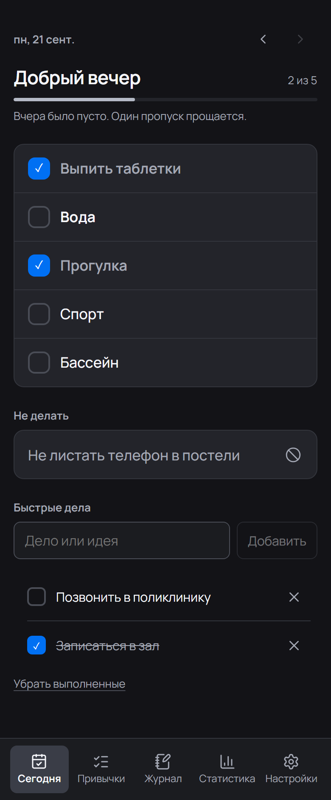
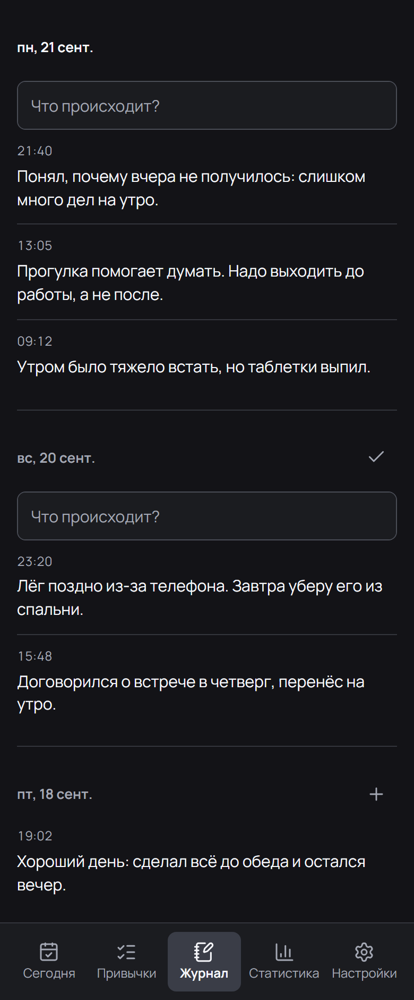
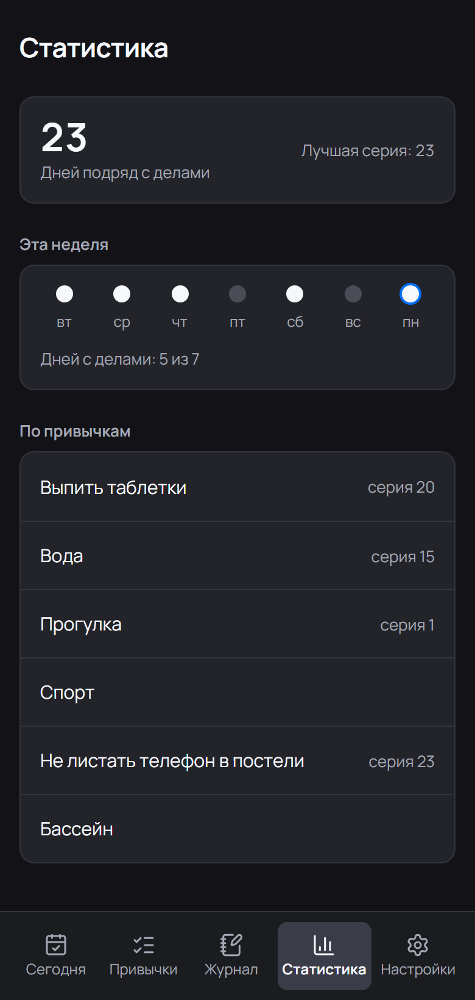
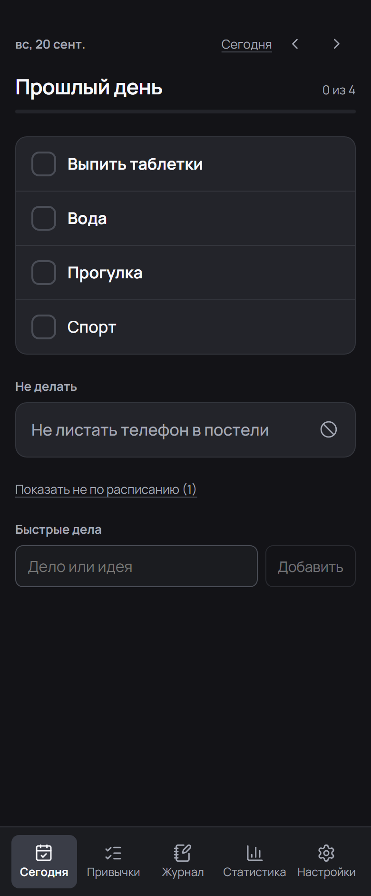
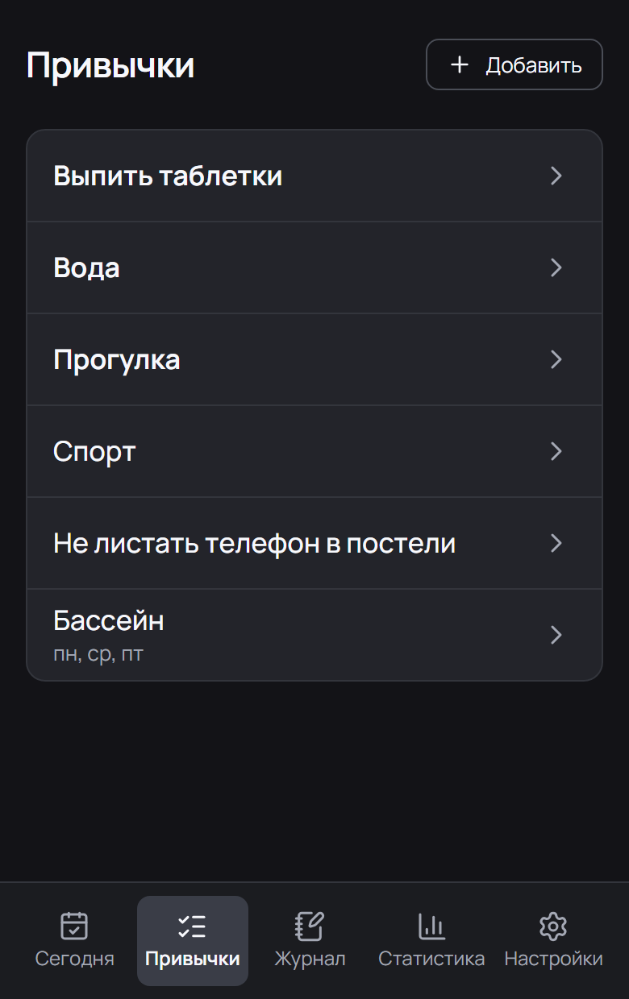
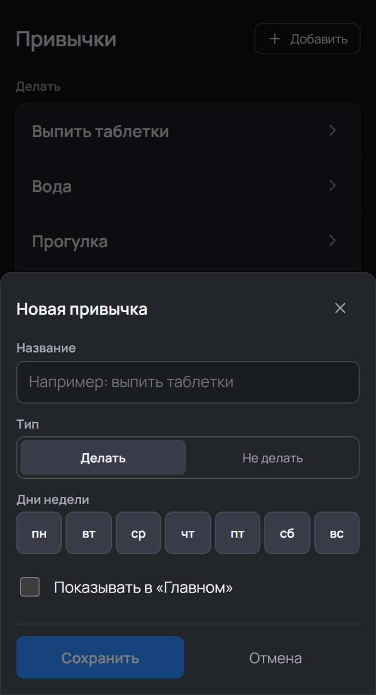
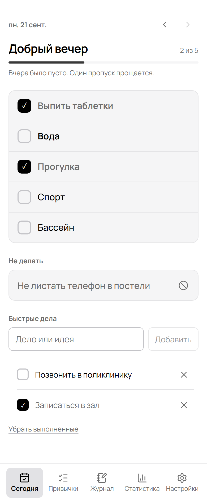
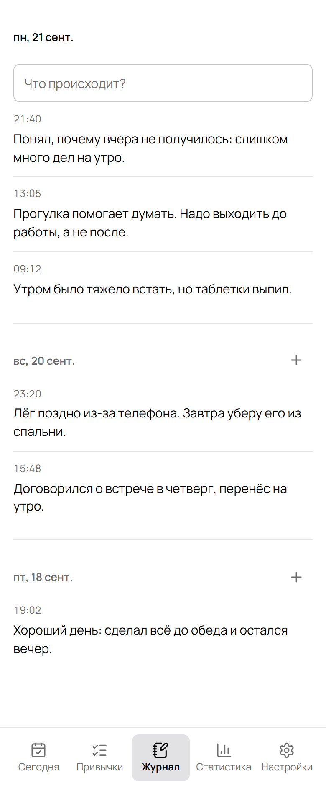
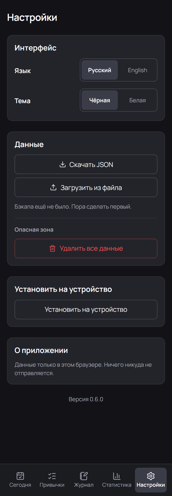

<div align="center">

# ✅ deeptracker

**A minimal offline habit tracker for an ADHD brain.**
One tap per habit — there is no «how many glasses» to choose. Soft streaks, at most three
main things a day, two numbers in the stats, and a journal that is a feed: one Enter per
thought. No accounts, no ads, no network: everything stays in the browser.

**English** · [Русский](README.ru.md)

### 🚀 [Open the app →](https://dreminmx-tech.github.io/deeptracker/)

[](https://github.com/dreminmx-tech/deeptracker/actions/workflows/deploy.yml)
[](LICENSE)
[](docs/technical.md#pwa)
[](docs/technical.md#tests)
[](https://react.dev)
[](https://www.typescriptlang.org)
[](https://vite.dev)
[](docs/technical.md#build)

<table>
  <tr>
    <td align="center"><br><sub>Today</sub></td>
    <td align="center"><br><sub>Journal</sub></td>
    <td align="center"><br><sub>Stats</sub></td>
  </tr>
  <tr>
    <td align="center"><br><sub>Yesterday</sub></td>
    <td align="center"><br><sub>Habits</sub></td>
    <td align="center"><br><sub>New habit</sub></td>
  </tr>
  <tr>
    <td align="center"><br><sub>Light theme</sub></td>
    <td align="center"><br><sub>Journal, light</sub></td>
    <td align="center"><br><sub>Settings</sub></td>
  </tr>
</table>

</div>

---

## 🚀 Quick start

**Nothing to install:** [**dreminmx-tech.github.io/deeptracker**](https://dreminmx-tech.github.io/deeptracker/) — opens in a browser, installs on a phone, then works without internet.

Locally — three commands:

```bash
npm install
npm run dev      # http://127.0.0.1:5173
npm test         # 67 tests: pure logic + every screen rendered
```

Build and preview the production bundle:

```bash
npm run build    # typecheck + dist/
npm run preview  # http://127.0.0.1:4173
```

| I want to | Where to look |
| --- | --- |
| 🚢 Deploy my own copy to GitHub Pages | [docs/deploy.md](docs/deploy.md) |
| 🔧 How it works inside: logic, data, tests | [docs/technical.md](docs/technical.md) |
| 🎨 Palette and theme tokens | [docs/technical.md#palette](docs/technical.md#palette) |
| 🐛 The browser cannot open localhost | [docs/deploy.md#troubleshooting](docs/deploy.md#troubleshooting) |

## ✨ What is inside

- ✅ **A habit is a checkbox.** No «how many glasses», no «how many minutes»: the app only asks «did you do it or not», and the answer is one tap on the row. Choosing an amount was the friction that made a tracker unpleasant to use; if something takes twenty minutes, it is a task, not a habit.
- 🪶 **Soft streaks** — «never miss twice»: one missed day does not reset progress, only two in a row do, and an open today is not a miss at all. If yesterday was empty, the app says so in one short sentence.
- 🗓 **Yesterday is one tap** — the date in words on the left, two arrows on the right: a day back and a day forward. Any past day opens and can be edited, and there is a link back to today. No week flipping, no «which week am I on?».
- 📆 **Weekday schedules** — «weekdays», «Mon, Wed, Fri»: a day off schedule is not a miss and does not break the streak. On the Today screen such a habit stays out of the way, and one link shows it.
- 🎯 **The main three** — at most three habits on top, the rest below: less choice paralysis.
- 📓 **A journal that is a feed** — one field at the top, one Enter: the thought lands in today's day with its time, newest on top and yesterday below. Every keystroke is saved as you type, so a closed app loses nothing. A note is rewritten by tapping it, and it cannot be deleted at all — which is exactly why a slip of the finger costs nothing. Any past day opens with a «+» if something needs to be added there.
- 📊 **Stats in two numbers and seven dots** — the streak, the best streak, and the week as dots: a dot is a day, progress or not. No 30/90 windows, no thirty-bar strips, no legends: a chart you have to decode is exactly why nobody wants to open the stats tab.
- 📐 **Dense, no walls of text** — one row pattern for every list, one shape for every control (8px radius), heights from one scale (32/40/44/56), spacing from one grid (4…32), a card always 16px inside and 12px between children. There is almost no copy in the UI: every sentence is something you read instead of closing a habit.
- 🔵 **One blue per screen** — colour means the state of a habit, not decoration: only a checked box and the main action button are blue. Cards are read by a thin light line rather than a heavy fill, and the active tab is just a raised grey pill. No yellow at all, red is left to the «delete everything» button.
- 🧠 **Quick things** — a short inbox for today's non-routine tasks and ideas, so you do not have to hold them in your head.
- 🧹 **Data without chaos** — backup with two **identical** buttons (download / load), and deleting lives in a «danger zone» where only the button itself is red. The app remembers when you last downloaded a file and nudges you after three weeks: your data lives in this browser only.
- 📴 **Fully offline** — a service worker, a manifest and icons: install it on a phone and it works on a plane.
- 🔒 **Private by default** — no accounts, no analytics, no network; data lives in `localStorage`, backup is a JSON export.
- 🌗 **Two themes and its own typography** — dark in DeepSeek Platform dashboard colours, light strictly black and white; Manrope self-hosted (Cyrillic + Latin), icons from Lucide. The interface is in Russian and English.
- 🔗 **Deep links** — `/#journal`, `/#stats`, `/#habits`, `/#settings`: bookmark a screen and open it directly.

### 🗂 The two habits there are

| Type | How it works |
| --- | --- |
| ✅ Do | Done / not done, one tap on the row |
| 🚫 Don't do | Clean by default, only slips are logged |

Any habit can keep just the weekdays it needs — the rest become days off and never count as misses.

Counters with a target, minutes with a timer and flexible weekly frequency stayed in the **data model**: the app still reads and counts them so that old history and old backups are not lost, but the interface no longer creates or edits such a habit — a new habit is always a checkbox.

## 📱 Installing on a phone

| Platform | How |
| --- | --- |
| 🤖 Android / Chrome | Open the site → browser menu → **Install app** (or the button in the app settings) |
| 🍎 iPhone / Safari | **Share** → **Add to Home Screen** |

Once installed, the app opens without internet and without an address bar.

## 📚 Documentation

| Document | What is in it |
| --- | --- |
| 🚢 [docs/deploy.md](docs/deploy.md) | Deploying your own copy to GitHub Pages: with `gh`, manually, by forking, custom domain, updates, troubleshooting |
| 🔧 [docs/technical.md](docs/technical.md) | Stack, structure, data model, the soft-streak algorithm, storage and import, PWA, palette, tests, scripts |

## 📄 License

[MIT](LICENSE) — do whatever you want, a link back is nice but not required.
